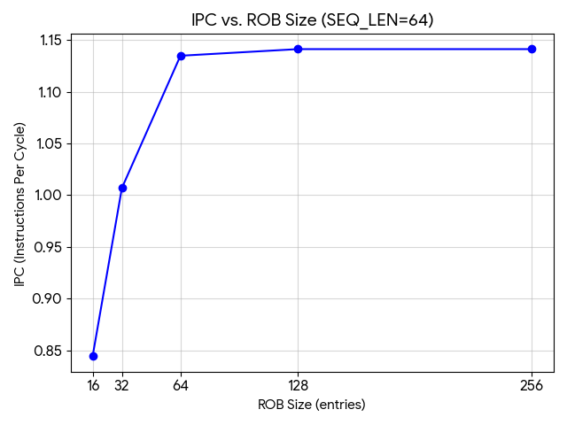
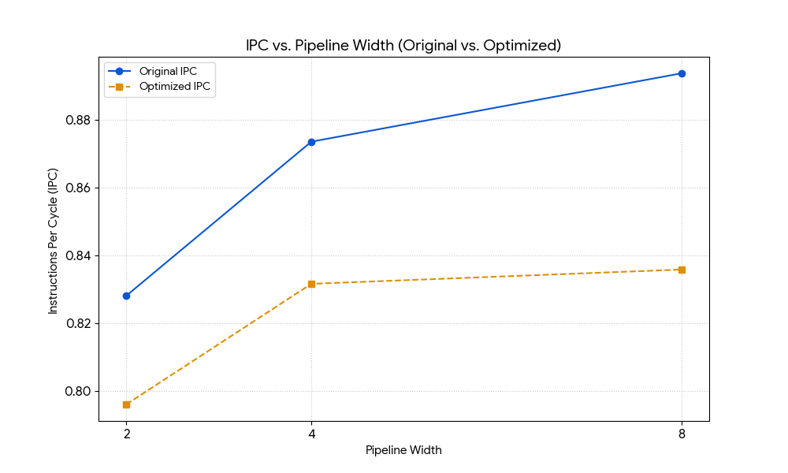
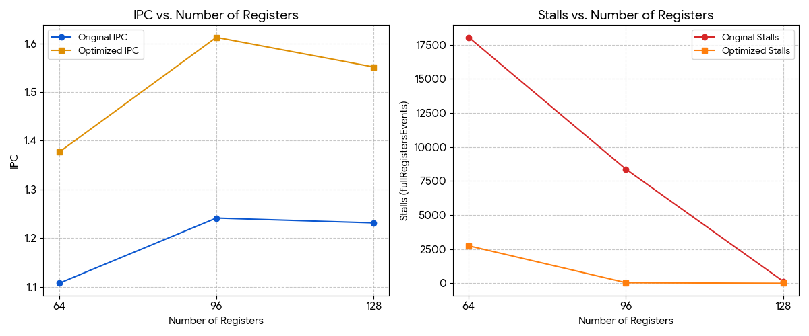

# First homework


## Task 1: Analyze performance of O3 processor (5 points)

You are given a program that computes **scaled dot-product attention scores** — the core non-GEMM operation in Transformer models. The source code is located in the `workload/scaled_dot_product.c` file.

To ensure consistent and comparable results across all submissions, all simulations must use the explicitly specified functional unit and cache configuration defined below. These parameters are fixed and must not be changed unless a task explicitly instructs you to vary them. The defult configuration of O3CPU and MinorCPU are definied in python files in folder `default/` and you can refer to them for more details.

### Task 1a:
First, report the following metrics from `stats.txt` for both CPU models:

| Metric       | MinorCPU | O3CPU    |
|--------------|----------|----------|
| CPI          | 1.509098 | 0.894233 |
| Total cycles | 100933   | 59809    |
| IPC          | 0.662647 | 1.118277 |

What is the IPC speedup of O3CPU over MinorCPU and explain it.

The O3CPU model achieves a $1.69\times$ higher IPC compared to the MinorCPU,
 demonstrating its superior efficiency in exploiting instruction-level parallelism.
This performance gain is primarily driven by out-of-order execution,
which allows the processor to dynamically schedule instructions.


### Task 1b: 
For parameter `SEQ_LEN=64` of workload, run O3CPU with ROB sizes of 16, 32, 64, 128 and 256 entries and Plot IPC vs. ROB size. At what ROB size does performance saturate? What does this tell you about the instruction-level parallelism (ILP) available in this workload?

| Rob size   | 16       | 32       | 64       | 128      | 256       | 
|------------|----------|----------|----------|----------|-----------|
| O3         | 0.844347 | 1.006918 | 1.134746 | 1.141128 | 1.141128  |



Performance saturates at a ROB size of 128, beyond which no further IPC gains are observed. This indicates that the workload's ILP is limited by intrinsic data dependencies, rendering larger instruction windows redundant for this specific SEQ_LEN.

### Task 1c:  
Rerun both the original and optimized version (`scaled_dot_product_adv`) of the attention kernel on O3CPU, sweeping pipeline width  over  2, 4, and 8 width of different stages to the same value. Record IPC for each combination and plot both versions on the same graph as IPC vs. pipeline width. Analyze whether the IPC gap between the two versions grows or shrinks as the pipeline widens, and explain what this reveals about the relationship between  ILP and hardware utilization.

| width | IPC (original) | IPC (optimized) |
|-------|----------------|-----------------|
| 2     | 0.828108       | 0.796039        |
| 4     | 0.873591       | 0.831634        |
| 8     | 0.893775       | 0.835853        |



The IPC gap between the two versions grows as the pipeline widens, showing that the original kernel scales more effectively with increased hardware resources.
This reveals that the optimized version likely contains more data dependencies or bottlenecks that limit instruction-level parallelism (ILP), preventing it from fully utilizing the additional execution width of the O3CPU.

### Task 1d:
For both version, original and optimized, sweep the number of physical integer and floating-point registers over 64, 96, and 128 entries measuring IPC and the number of stalls caused by register file exhaustion (`system.cpu.rename.fullRegistersEvents`). Plot IPC and stalls vs. number of registers. At what point do additional registers stop improving IPC? Set the pipeline width to 2 and ROB size to 128 for this experiment. 

*Note: if you cannot find the `fullRegistersEvents` stat, than means that is equal to 0 , and you can report 0 for all of them.*

**Original**
| Metric | 64       | 96       | 128      |
|--------|----------|----------|----------|
| IPC    | 1.107041 | 1.240941 | 1.231028 | 
| Stalls | 18047    | 8369     | 144      | 

**Optimized**
| Metric | 64       | 96       | 128      |
|--------|----------|----------|----------|
| IPC    | 1.376532 | 1.612539 | 1.551698 | 
| Stalls | 2747     | 44       | 0        | 



Both versions peak at 96 physical registers.

## Task 2: Branch Prediction and Speculative Execution in Masked Attention (O3CPU) (5 points)

In autoregressive Transformer models (such as GPT), the attention mechanism applies a **causal mask** to prevent each token from attending to future positions. Before the softmax is computed, all positions $j > i$ for query $i$ are set to $-\infty$, ensuring their contribution after softmax is zero. This masking introduces **data-dependent branches** whose taken/not-taken ratio changes systematically across query positions — early queries mask most of the sequence, late queries mask almost nothing. This makes the workload particularly interesting for branch prediction analysis: the branch behavior is neither fully predictable nor fully random, but shifts gradually across the outer loop iterations.

---

### The Workload

The program computes masked scaled dot-product attention for every query position in a sequence. It is located in the `workload/` folder. The two branches of interest are:

```c
void masked_softmax(float *scores, float *output, int query_pos, int len) {

    // Branch 1 — Causal mask
    // Taken ratio = (len - query_pos) / len
    // Shifts from ~100% (query 0) to ~0% (query SEQ_LEN-1)
    for (int j = 0; j < len; j++) {
        if (j > query_pos)
            scores[j] = NEG_INF;
    }

    // Branch 2 — Max reduction
    // Fully data-dependent, no learnable pattern
    float max_val = scores[0];
    for (int i = 1; i < len; i++) {
        if (scores[i] > max_val)
            max_val = scores[i];
    }

    // ... exp, sum, normalize (no branches)
}
```

---


### Task 2a
Compile and run the masked attention workload using the baseline configuration. Record the following from `stats.txt`:

| Metric                        | Value   |
|-------------------------------|---------|
| Total instructions committed  | 2194513 |
| Total cycles                  | 1774059 |
| IPC                           | 1.23700 |
| Branch instructions committed | 335874  |
| Branch mispredictions         | 496     |


### Task 2b
Run the workload with the following four branch predictors (`TournamentBP`,`LocalBP`,  `BiModeBP` and `TAGE`), keeping all other parameters fixed. Record for each predictor:

| Predictor  | Branch mispredictions  | IPC     | 
|------------|------------------------|---------|
| TAGE       | 1088                   | 0.81348 |
| LocalBP    | 5430                   | 0.83041 |
| Tournament | 4673                   | 0.82353 |
| BimodeBP   | 4788                   | 0.82484 |

*Note: Metric for branch mispredictions count is: `branchPred.condIncorrect` while the metric for Branch instructions committed is: `branchPred.committed_0::total`*


Which predictor achieves the lowest misprediction count and why?

TAGE achieves the lowest misprediction count because it uses multiple tables with varying history lengths to accurately capture both simple and complex branching patterns.

### Task 2c
Using the best-performing predictor from *Q2*, sweep ROB size over **32, 64, and 128 entries**:

Record for each ROB size:

| ROB Size | Misprediction count | IPC      | Squashed instruction count |
|----------|---------------------|--------- |----------------------------|
| 32       | 1000                | 0.920332 | 941                        |
| 64       | 1028                | 1.230500 | 1010                       |
| 128      | 1088                | 1.229281 | 1026                       |

*Note: Metric for Squashed instruction count is: "core.numSquashedInsts"*

As ROB size increases, what happens simultaneously to IPC and to instructions flushed per misprediction? .

As the ROB size increases, IPC initially rises because the processor can find more parallel instructions to execute, but then it plateaus as other hardware limits are reached. Simultaneously, the number of squashed instructions per misprediction increases because a larger buffer allows more "wrong-path" instructions to enter the pipeline before the error is caught.
